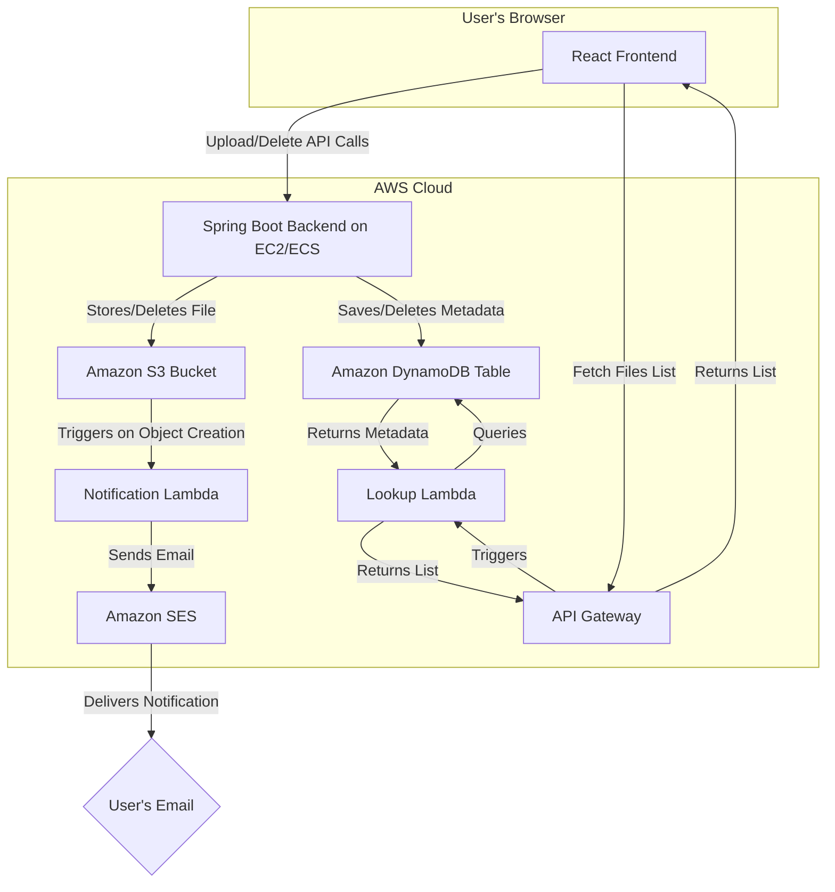

# FileDrop: Full-Stack File Storage Application

FileDrop is a complete, full-stack web application that provides a modern and user-friendly interface for uploading, managing, and deleting files. The entire application is built on a scalable cloud architecture using AWS, with infrastructure managed declaratively via Terraform.

This project demonstrates a real-world workflow for building and deploying a cloud-native application, integrating a React frontend, a Java Spring Boot backend, and a suite of serverless AWS services.

**Check out the live project screenshots below!**

`[Screenshot of the upload interface]`


`[Screenshot of file library]`


---

## ✨ Core Features

*   **Modern UI**: A clean, responsive, and intuitive user interface built with React.
*   **Drag & Drop File Uploads**: Easily upload files by dragging them into the browser.
*   **File Library**: View, sort, and manage all uploaded files in a central library.
*   **Secure Deletion**: Permanently delete files from the storage system.
*   **Asynchronous Email Notifications**: Receive an email notification every time a new file is uploaded, powered by a decoupled serverless function.
*   **Infrastructure as Code (IaC)**: All AWS resources are defined and managed with Terraform for consistency and repeatability.

---

## 🛠️ Tech Stack & Architecture

This project is composed of several key components working in concert:

*   **Frontend**: **React** (with Vite) for the user interface.
*   **Backend**: **Java Spring Boot** for the core REST API (file uploads/deletions).
*   **File Storage**: **Amazon S3** for scalable and durable object storage.
*   **Database**: **Amazon DynamoDB** for storing and retrieving file metadata.
*   **Serverless APIs**:
    *   **AWS Lambda** (Python) for the file lookup endpoint.
    *   **Amazon API Gateway** to expose the Lambda function as a public REST API.
*   **Serverless Notifications**:
    *   **AWS Lambda** (Python) triggered by S3 events.
    *   **Amazon SES** to send email notifications.
*   **Infrastructure**: **Terraform** to define and provision the entire cloud infrastructure.

### Architecture Diagram



---

## 🚀 Getting Started

To run this project locally, you will need an AWS account and the following tools installed:

*   [AWS CLI](https://aws.amazon.com/cli/), configured with your credentials (`aws configure`)
*   [Terraform](https://www.terraform.io/downloads.html)
*   [Java JDK (17 or higher)](https://www.oracle.com/java/technologies/downloads/) & Maven
*   [Node.js & npm](https://nodejs.org/en/)

### 1. Deploy the Cloud Infrastructure

The Terraform scripts will provision all the necessary AWS resources.

```bash
# Navigate to the terraform directory
cd terraform/

# Create a configuration file for your variables
# (Copy the contents of terraform.tfvars.example and fill in your details)
cp terraform.tfvars.example terraform.tfvars

# Initialize Terraform
terraform init

# Apply the configuration to deploy resources
terraform apply
```
After applying, Terraform will output the names of your S3 bucket and the API Gateway URL. You will need these for the next steps.

### 2. Configure and Run the Backend

```bash
# Navigate to the backend directory
cd backend/

# Open src/main/resources/application.properties and set the
# 'aws.s3.bucket.name' property to the S3 bucket name from the terraform output.

# Run the Spring Boot application
mvn spring-boot:run
```
The backend server will start on `http://localhost:8080`.

### 3. Configure and Run the Frontend

```bash
# Navigate to the frontend directory
cd frontend/

# Create a local environment file
# (Copy the contents of .env.example and fill in the values)
cp .env.example .env.local

# Open .env.local and set 'VITE_API_LOOKUP_URL' to the API Gateway URL
# from the terraform output.

# Install dependencies
npm install

# Start the development server
npm run dev
```
The frontend will be available at `http://localhost:5173`. Open this URL in your browser to use the application. 
